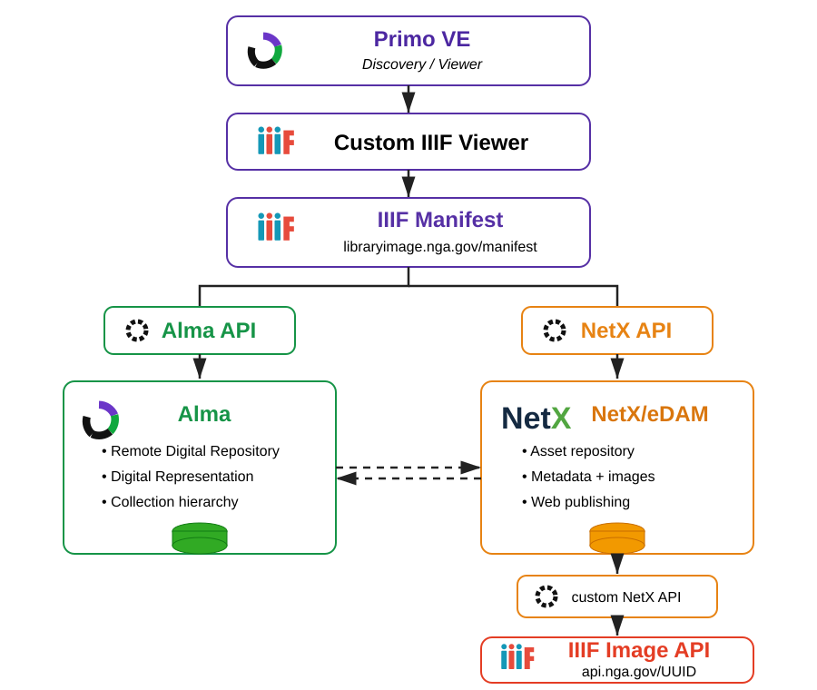

# NGA Library Alma–NetX–IIIF Integration

Technical documentation for the National Gallery of Art Library integration connecting **Ex Libris Alma**, **Primo VE**, **NetX/eDAM**, and **IIIF services**.

## Purpose

This project enables the Library to manage descriptive and discovery relationships in Alma/Primo while keeping master digital assets in the Gallery's eDAM/NetX environment. IIIF provides the standards-based delivery layer between the digital asset repository and the Library discovery interface.

The implementation was designed around a clear separation of responsibilities:

- **Alma** — bibliographic metadata, collections, digital representations, and remote digital repository relationships.
- **NetX/eDAM** — authoritative storage and management of digital image assets and associated metadata.
- **IIIF** — image delivery, manifests, canvases, and interoperable presentation services.
- **Primo VE** — public discovery and embedded IIIF viewing experience.

## Overview

### System Architecture

The architecture separates library resource management, digital asset management, IIIF delivery, and public discovery while connecting them through Alma Remote Digital Repository, NetX/eDAM APIs, IIIF manifests, and the Primo viewer.

See [System Architecture](docs/architecture.md) for details.

  

### Digital Publishing Workflow

The publishing workflow covers the operational path from digitization/acquisition and eDAM web publishing through IIIF delivery, manifest processing, Alma digital representation, and Primo discovery.

See [Digital Publishing Workflow](docs/digital-publishing-workflow.md) for details.
lign="center">
  <i
## Repository Documentation

- [System Architecture](docs/architecture.md)
- [Implementation History](docs/implementation-history.md)
- [Digital Publishing Workflow](docs/digital-publishing-workflow.md)
- [Alma Configuration](docs/alma-configuration.md)
- [Primo IIIF Viewer](docs/primo-iiif-viewer.md)
- [Troubleshooting and Operations](docs/troubleshooting.md)
- [Identifier and Manifest Patterns](examples/identifier-patterns.md)

## Historical Context

The Library originally used a local image server that handled digital asset storage, IIIF APIs/services, viewer delivery, and manifest generation. In 2021 the Library began moving digital assets into the Gallery's NetX/eDAM environment.

The new workflow starting June 1, 2021 includes uploading newly digitized images and metadata into eDAM, web-publish them, and deliver them through UUID-based IIIF services. Existing digital titles were migrated in batches.

The integration includes two principal implementation areas:

1. Alma configuration using a Remote Digital Repository and digital representations so Primo could expose **View Online**.
2. Primo customization using HTML/JavaScript/CSS and AngularJS to embed an IIIF viewer and manifest in the full record display.

## Current Evolution

The underlying architecture remains valid for Primo NDE. The primary change is at the presentation layer: the legacy Primo customization package must be rewritten for the NDE framework to continue embedding the IIIF viewer.

## License

See [LICENSE](LICENSE).
